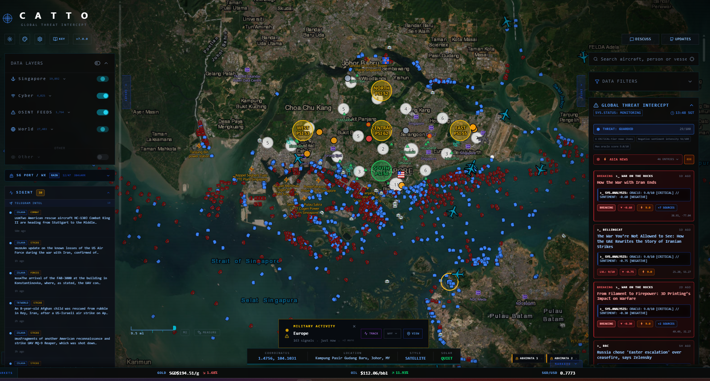

# CATTO v8.0.0

**Singapore-focused OSINT intelligence dashboard for security analysts and SOC operators.**

Catto is a real-time geospatial intelligence platform that fuses live public data feeds into a single dark-ops map interface. Built for security operations teams, open-source researchers, and anyone who needs a unified view of what is happening across Singapore, the region, and the world.

It is self-hosted, runs entirely on your machine via Docker, requires no cloud accounts, collects no telemetry, and stores no user data.

Built with **Next.js 15**, **FastAPI**, **MapLibre GL**, **deck.gl**, and **Python 3.12**.

---

> **Catto is actively developed.** Planned expansions include country-specific intelligence layers for Malaysia, Indonesia, Philippines, Taiwan, and Japan — with more countries added based on traction. Contributions and feedback welcome via [GitHub Issues](https://github.com/cattoosint/Catto/issues).



---

## What Catto Is For

Catto is designed for analysts who need to answer questions like:

- Are there military flights active over the South China Sea right now?
- Which ransomware groups have hit Singapore-linked infrastructure in the last 24 hours?
- Is there a correlation between a known C2 server and nearby data centre infrastructure?
- What is the current air quality and weather situation across Singapore's regions?
- Are there active piracy incidents near Malacca Strait shipping lanes?
- Which satellites are overhead and what are their mission types?

It is not a consumer app. It is an analyst workstation for a map.

---

## Four Intelligence Pillars

| Pillar | Focus |
|--------|-------|
| **Singapore** | LTA traffic, MPA vessels, CCTV mesh, weather, SCDF, SGSecure, bus stops, NEA PSI |
| **Cyber** | CISA KEV, ransomware IOCs, Feodo C2, OTX pulses, Shodan, internet outages, data centres, SDR/SIGINT |
| **Conflict** | Military flights, GPS jamming, tracked aircraft (POTUS alert), military bases, Ukraine, GDELT, UCDP, ACLED |
| **World** | Commercial/private flights (Asia-Pacific default), AIS vessels, satellites, fires, earthquakes, weather, piracy, Malaysia weather, CWA Taiwan alerts, ReliefWeb SEA crises, ACAPS severity |

---

## Full Feature List

### Singapore Pillar
- **LTA road incidents** — live emergency and road event feed from LTA DataMall
- **Bus stops** — 5,000+ LTA stops with codes and arrivals, visible from zoom 14+
- **MPA Port Vessels** — live vessel positions from MPA OCEANS-X (ON by default)
- **NEA PSI air quality** — regional PSI readings (North, South, East, West, Central), no API key required
- **NEA weather** — 2-hour nowcast and regional conditions with live popup
- **SCDF incidents** — Singapore Civil Defence Force emergency response events
- **SGSecure alerts** — public safety and security advisories
- **CCTV mesh** — live LTA traffic camera thumbnails; click to view full stream
- **SAF/RSAF/RSN installations** — Singapore Armed Forces base markers (globally visible)
- **SPF establishments** — Singapore Police Force locations

### Cyber Pillar
- **CISA KEV** — CISA Known Exploited Vulnerabilities, geolocated to infrastructure
- **Ransomware IOCs** — active indicators from ransomware.live, filtered to **last 24 hours** globally; if Singapore is among the targeted countries, the full unfiltered list is shown so SG incidents are never hidden
- **Feodo botnet C2** — C2 server list with geolocation
- **AlienVault OTX** — threat intelligence pulses rendered as map events
- **CSA/SingCERT advisories** — Singapore Cyber Security Agency alert feed
- **Shodan overlay** — operator-key query results as investigative layer
- **Internet outages** — IODA / RIPE Atlas global outage events
- **Data centres** — global data centre reference layer
- **Power plants** — global power generation infrastructure (24 h cache)
- **KiwiSDR** — global software-defined radio receiver network
- **PSK Reporter** — HF amateur radio propagation spots
- **SatNOGS** — ground station network for satellite telemetry
- **TinyGS** — LoRa satellite ground stations
- **APRS** — amateur radio automatic position reporting (opt-in)

### Conflict Pillar
- **Military flights** — aircraft from OpenSky, colour-coded by type (fighter, heli, tanker, recon, cargo); rendered as deck.gl IconLayer with top-down silhouettes
- **ADS-B military** — supplemental feed via ADS-B Exchange
- **Tracked aircraft** — POTUS fleet, Air Force One, Marine One, government aircraft with enriched popups
- **POTUS airborne alert** — CRITICAL toast notification when Air Force One is detected
- **GPS jamming zones** — active spoofing/jamming zones from GPSJam.org
- **Military bases** — global installation reference layer
- **Ukraine frontline** — live conflict polygon from DeepStateMap
- **Ukraine air raids** — active alerts from Ukraine Alert API
- **GDELT conflict events** — up to 1,000 geolocated conflict/war news events (last 24 hours); rendered as deck.gl ScatterplotLayer globally (no viewport cull)
- **UCDP conflict events** — Uppsala Conflict Data Programme armed conflict events (up to 2,000); global render
- **ACLED events** — Armed Conflict Location & Event Data; global render
- **IMB piracy incidents** — ICC-CCS piracy and armed robbery incidents, filtered to **last 14 days**, rendered globally via deck.gl
- **NOTAMs** — active Notices to Air Missions with location markers
- **Correlations** — cross-layer threat correlation linking cyber events to nearby infrastructure
- **Telegram monitor** — live conflict channel feed (configurable channel list)

### World Pillar
- **Commercial flights** — Asia-Pacific live ADS-B traffic (ON); USA/Europe opt-in (Others tab, OFF); deck.gl top-down silhouette icons
- **Private flights & jets** — general aviation, Asia-Pacific default; USA/Europe opt-in
- **World Ships (AIS)** — global AIS stream, viewport-culled (Others tab, OFF by default)
- **Satellites** — 11,000+ objects with real-time SGP4 position interpolation, updated every 10 min; rendered as deck.gl IconLayer with mission-type icons (SAR, SIGINT, EW, nav, comms, ISS); ISS gets a gold halo ring
- **NASA FIRMS fires** — up to 15,000 active fire hotspots from MODIS/VIIRS within 24 h; colour-coded by brightness temperature; deck.gl IconLayer
- **USGS earthquakes** — seismic events, colour-coded by magnitude; deck.gl IconLayer (no cap)
- **Severe weather** — NOAA/NWS alerts and severe weather polygons
- **Volcanoes** — globally active and monitored volcanoes
- **Fishing activity** — Global Fishing Watch vessel event data
- **VIIRS night lights** — NASA Black Marble night-lights imagery
- **Satellite imagery** — Esri World Imagery, NASA GIBS MODIS, Sentinel Hub Copernicus S2

### Analyst Tools
- **IOC quick lookup** — query VirusTotal, OTX, Feodo, AbuseIPDB simultaneously; MALICIOUS/SUSPICIOUS/CLEAN verdict
- **CVE quick search** — CVSS score, affected products, CISA KEV status, NVD references
- **Incident notepad** — scratchpad for observations, IOCs, timeline notes; auto-saves; exports as `.txt`
- **CattoIntel** — AI-assisted analyst briefing panel
- **Region dossier** — right-click any country for head of state, population, languages, Sentinel-2 imagery
- **Find / Locate** — search and fly-to for entities, coordinates, and place names
- **Watchlist** — track specific vessels, aircraft, and entities with gold ring highlight
- **Crisis tracker** — structured incident tracking with timeline
- **Morning briefing** — auto-generated intelligence summary on load
- **Ollama AI (v8.0)** — on-device Mistral-Nemo 12B; ANALYSE (map popup), DIGEST (Telegram), BRIEF (news), EXPLAIN (correlations), Ask Catto (free text); no cloud, no API key, graceful "AI OFFLINE" fallback
- **Timeline scrubber (v8.0)** — 24h snapshot history (SQLite, every 15 min); scrubber bar above locate input; LIVE button snaps back to real-time
- **Smart escalation popups (v8.0)** — HIGH-confidence correlation triggers non-dismissible 10-second popup; ESCALATE centers map, DISMISS+30min suppression, DND mode 1hr; Ollama assessment after 15s

### UI & Performance
- **Global situation indicator** — per-region status light driven by live signal spikes: green (no incident / low activity), yellow (heightened alert), red (significant activity across multiple signals)
- **Top-bar STATUS widget** — single overall status derived from all regions; replaces the former solar/Kp index display; green = NO INCIDENT, yellow = HEIGHTENED, red = ELEVATED
- **War-room dark UI** — Carto Dark Matter basemap, monospace display, collapsible panels
- **deck.gl GPU rendering** — ships, flights, satellites, earthquakes, FIRMS fires, piracy, GDELT/UCDP conflict markers all rendered via deck.gl for GPU-accelerated performance
- **Viewport culling engine** — only markers in visible bounds (+20% buffer) committed to GeoJSON for MapLibre layers; global layers bypass cull entirely
- **Military always-global** — military flights, vessels, SAF/RSAF/RSN, satellites bypass viewport cull
- **Staggered startup** — data fetches delayed 15s/45s to prevent startup OOM; warmup progress bar
- **Imperative map updates** — all high-volume layers bypass React reconciliation via direct `setData()`
- **Electron desktop app** — native window with 8 GB V8 heap; system tray with minimize-to-tray
- **SGT / UTC clock** — live Singapore time and UTC widget, updates every second
- **Feed health panel** — green/amber/red status for every active data feed
- **ETag polling** — 304 Not Modified skips processing; fast tier 30s, slow tier 120s
- **Exponential backoff** — failed requests retry at 5s → 10s → 20s → 40s → 60s
- **Map style toggle** — Carto Dark Matter / Satellite (Esri) / Sentinel Hub

---

## Architecture

```
╔══════════════════════════════════════════════════════════════════════╗
║                        CATTO v8.0.0                                  ║
╠══════════════════════════════════════════════════════════════════════╣
║                                                                      ║
║  ┌─────────────────────┐        ┌──────────────────────────────┐    ║
║  │  Electron Desktop   │        │     Next.js Frontend          │    ║
║  │  (Chromium + V8)    │◄──────►│     localhost:3002            │    ║
║  │  8 GB JS heap       │        │  React + MapLibre GL          │    ║
║  │  system tray icon   │        │  deck.gl (GPU layers)         │    ║
║  └─────────────────────┘        │  Tailwind CSS v4              │    ║
║                                 │  Web Workers (GeoJSON build)  │    ║
║                                 └──────────┬───────────────────┘    ║
║                                            │ /api/* proxy            ║
║                                            ▼                         ║
║                                 ┌──────────────────────────────┐    ║
║                                 │   FastAPI Backend             │    ║
║                                 │   localhost:8002              │    ║
║                                 │   Python 3.12 + uvicorn       │    ║
║                                 │   ETag caching · staggered    ║    ║
║                                 │   fetchers · per-layer filter │    ║
║                                 └──────────┬───────────────────┘    ║
║                                            │                         ║
║         ┌──────────────┬──────────────┬───┴──────────────┐          ║
║         ▼              ▼              ▼                   ▼          ║
║  ┌─────────────┐ ┌──────────┐ ┌────────────┐ ┌───────────────────┐ ║
║  │  Singapore  │ │  Cyber   │ │  Conflict  │ │      World        │ ║
║  │  LTA · NEA  │ │ CISA·OTX │ │OpenSky·ADS │ │ adsb.lol · AIS   │ ║
║  │  MPA·SCDF   │ │ Shodan   │ │ GDELT·UCDP │ │ CelesTrak · USGS │ ║
║  │  SGSecure   │ │ Feodo    │ │ GPSJam·IMB │ │ FIRMS · NOAA     │ ║
║  └─────────────┘ └──────────┘ └────────────┘ └───────────────────┘ ║
║                                                                      ║
╚══════════════════════════════════════════════════════════════════════╝

Data flow:
  Backend fetcher → in-memory store → /api/live-data/fast (30s poll)
                                    → /api/live-data/slow (120s poll)
  Frontend poll   → Web Worker → GeoJSON build → imperative setData()
  GPU layers      → deck.gl MapboxOverlay → WebGL ScatterplotLayer / IconLayer
  Map render      → MapLibre GL WebGL → viewport culled → GPU
```

**Stack:**
| Component | Technology |
|-----------|-----------|
| Frontend | Next.js 15, React 19, Tailwind CSS v4, MapLibre GL |
| GPU Layers | deck.gl 9.x (MapboxOverlay, IconLayer, ScatterplotLayer) |
| Desktop | Electron 33, Chromium, V8 8 GB heap |
| Backend | FastAPI, Python 3.12, uvicorn, slowapi |
| Data store | `useSyncExternalStore` per-key subscriptions |
| Map layers | Web Workers, imperative `source.setData()` |
| Containers | Docker Compose, 3 GB backend / 2 GB frontend limits |

---

## Data Sources

| Source | Layer | Key Required |
|--------|-------|-------------|
| LTA DataMall | Road incidents, traffic, bus stops, MRT | `LTA_ACCOUNT_KEY` |
| MPA OCEANS-X | Singapore port vessels | `OCEANS_X_API_KEY` |
| OpenSky Network | Commercial & military flights | `OPENSKY_CLIENT_ID/SECRET` |
| adsb.lol / ADS-B | Flight positions (primary) | None (public) |
| ADS-B Exchange | Military supplemental | None (public) |
| AIS Stream | Global vessel AIS | `AIS_API_KEY` |
| CelesTrak / TLE API | Satellite orbital elements | None (public) |
| NASA FIRMS VIIRS | Active fire hotspots | `FIRMS_MAP_KEY` (optional) |
| USGS | Earthquake events | None (public) |
| NOAA/NWS | Severe weather alerts | None (public) |
| GPSJam.org | GPS jamming zones | None (public) |
| GDELT Project | Global conflict news events | None (public) |
| UCDP | Armed conflict events | None (public) |
| ACLED | Armed conflict location data | `ACLED_EMAIL/PASSWORD` |
| ICC-CCS / IMB | Maritime piracy incidents (last 14 days) | None (public) |
| DeepStateMap | Ukraine frontline | None (public) |
| Ukraine Alert API | Air raid alerts | `ALERTS_IN_UA_TOKEN` |
| CISA | Known exploited vulnerabilities | None (public) |
| AlienVault OTX | Threat intelligence pulses | `OTX_API_KEY` |
| Feodo Tracker | Botnet C2 servers | None (public) |
| ransomware.live | Ransomware victim feed (last 24h) | None (public) |
| Shodan | Host intelligence overlay | `SHODAN_API_KEY` |
| VirusTotal | IOC malware lookup | `VIRUSTOTAL_API_KEY` |
| AbuseIPDB | IP abuse scoring | `ABUSEIPDB_API_KEY` |
| IODA / RIPE Atlas | Internet outages | None (public) |
| data.gov.sg / NEA | PSI air quality, weather | None (public) |
| KiwiSDR.com | SDR receivers | None (public) |
| PSK Reporter | HF radio spots | None (public) |
| SatNOGS | Ground stations | None (public) |
| TinyGS | LoRa satellites | None (public) |
| APRS-IS | Amateur radio positions | None (public) |
| Global Fishing Watch | Fishing activity events | `GFW_API_TOKEN` |
| Telegram MTProto | Conflict channel monitor | `TELEGRAM_API_ID/HASH` |
| Ollama (v8.0) | On-device Mistral-Nemo 12B AI | None (self-hosted Docker) |
| MetMalaysia (v8.0) | Malaysia weather stations | None (public) |
| CWA Taiwan (v8.0) | Taiwan earthquake + typhoon alerts | None (public) |
| ReliefWeb (v8.0) | Humanitarian crises — SEA | None (public) |
| ACAPS (v8.0) | Crisis severity — SEA | None (public) |
| NASA GIBS | MODIS daily imagery | None (public) |
| Sentinel Hub | Copernicus S2 imagery | GEE service account key |
| Esri | World Imagery basemap | None (public) |
| CARTO | Dark Matter basemap tiles/fonts | None (public) |
| Finnhub | Defence stocks & markets | `FINNHUB_API_KEY` |

---

## Environment Variables

Copy `.env.example` to `.env` and fill in the keys below.

### Required — Core features will not load without these

| Variable | Description | Where to get it |
|----------|-------------|-----------------|
| `LTA_ACCOUNT_KEY` | Singapore road incidents, bus stops | [datamall.mytransport.sg](https://datamall.mytransport.sg) → API access |
| `OPENSKY_CLIENT_ID` | Flight tracking (commercial + military) | [opensky-network.org](https://opensky-network.org) → Account → API clients |
| `OPENSKY_CLIENT_SECRET` | Paired with OPENSKY_CLIENT_ID | Same as above |
| `AIS_API_KEY` | Live vessel AIS WebSocket stream | [aisstream.io](https://aisstream.io) → free tier |
| `OCEANS_X_API_KEY` | MPA Singapore port vessel positions | [mpa.gov.sg](https://www.mpa.gov.sg) / Oceans-X portal |

### Optional — Unlock additional intelligence layers

| Variable | Layer | Where to get it |
|----------|-------|-----------------|
| `OTX_API_KEY` | AlienVault OTX threat pulses + IOC lookup | [otx.alienvault.com](https://otx.alienvault.com) → Settings → API Key |
| `VIRUSTOTAL_API_KEY` | IOC malware engine hits | [virustotal.com](https://www.virustotal.com) → Settings → API Key |
| `ABUSEIPDB_API_KEY` | IP abuse confidence score | [abuseipdb.com](https://www.abuseipdb.com) → Account → API |
| `SHODAN_API_KEY` | Shodan host/search overlay | [account.shodan.io](https://account.shodan.io) |
| `FINNHUB_API_KEY` | Defence stocks & market data | [finnhub.io](https://finnhub.io) → free tier |
| `FIRMS_MAP_KEY` | NASA fire data (country-scoped) | [firms.modaps.eosdis.nasa.gov](https://firms.modaps.eosdis.nasa.gov) |
| `ALERTS_IN_UA_TOKEN` | Ukraine air raid alerts | [alerts.in.ua](https://alerts.in.ua) |
| `ACLED_EMAIL` | ACLED conflict event data | [developer.acleddata.com](https://developer.acleddata.com) |
| `ACLED_PASSWORD` | Paired with ACLED_EMAIL | Same as above |
| `TELEGRAM_API_ID` | Telegram conflict channel monitor | [my.telegram.org](https://my.telegram.org) → API development tools |
| `TELEGRAM_API_HASH` | Paired with TELEGRAM_API_ID | Same as above |
| `GFW_API_TOKEN` | Global Fishing Watch vessel events | [globalfishingwatch.org/our-apis](https://globalfishingwatch.org/our-apis) |
| `ADMIN_KEY` | Protects admin API endpoints | Generate any random string |

### Network (advanced)

| Variable | Description |
|----------|-------------|
| `CORS_ORIGINS` | Comma-separated allowed origins (default: localhost + LAN auto-detect) |
| `BIND` | Interface to bind Docker ports (default: `127.0.0.1`; set `0.0.0.0` for LAN) |

---

## Installation

### Windows (Recommended — Auto-Installer)

1. Make sure **Docker Desktop** is installed and running
2. Download or clone this repository
3. Double-click **`install.bat`** (run as Administrator if prompted)
   - Checks WSL, Docker, Node.js
   - Creates `.env` from `.env.example`
   - Builds Docker containers
   - Installs Electron dependencies
   - Creates a desktop shortcut
4. Open **`.env`** in Notepad and fill in your API keys
5. Launch Catto from the desktop shortcut or by running **`start_catto.bat`**

If the installer fails at any step, see **Manual Installation** below.

### macOS / Linux (Auto-Installer)

1. Make sure **Docker** is installed and running
2. Clone the repository and `cd` into it
3. Run the installer:
   ```bash
   chmod +x install.sh && ./install.sh
   ```
   - Checks Docker, Docker Compose, and Node.js
   - Creates `.env` from `.env.example`
   - Builds Docker containers
   - Installs Electron dependencies
4. Fill in your API keys in `.env`
5. Launch with:
   ```bash
   ./start_catto.sh
   ```

### Manual Installation (Windows / macOS / Linux)

**Prerequisites:**
- Docker Desktop (Windows/macOS) or Docker + Docker Compose v2 (Linux)
- Node.js v20 or newer (for the Electron desktop app)
- Git

```bash
# 1. Clone the repository
git clone https://github.com/cattoosint/Catto.git
cd Catto

# 2. Create and fill in your environment file
cp .env.example .env
# Open .env and add your API keys (see Environment Variables above)

# 3. Build and start Docker containers
#    First run downloads ~2 GB of base images — takes 5-10 minutes
docker compose up -d --build

# 4. Open the dashboard in your browser
#    http://localhost:3002

# 5. (Optional) Install and launch the Electron desktop app
cd electron
npm install
npm start
```

### Electron Desktop App — Manual Steps

If `install.bat` fails to install Electron, or you are on macOS/Linux:

```bash
# From the Catto root directory
cd electron

# Install dependencies (downloads Electron ~120 MB)
npm install

# If npm install fails due to network issues, try:
npm install --prefer-offline

# If Electron binary download fails separately:
npx electron-download

# Launch the desktop app (Docker containers must be running first)
npm start
# or
npx electron .
```

**Electron requirements:**
- Node.js v20 or newer (`node --version` to check)
- npm v8 or newer (`npm --version` to check)
- Docker containers must be running before launching Electron (`docker compose up -d`)

**If Electron still will not start:**
1. Delete `electron/node_modules` and `electron/package-lock.json`
2. Run `npm install` again from inside the `electron/` directory
3. If the Chromium binary is missing: `node node_modules/electron/install.js`
4. As a fallback, use the browser at `http://localhost:3002` — all features work in browser

### LAN / Network Access

To expose Catto on your local network (e.g. `192.168.1.x:3002`):

```env
# .env
BIND=0.0.0.0
```

Then restart: `docker compose down && docker compose up -d`. Access from any device on your network at `http://<your-ip>:3002`.

### Telegram Session Setup

Telegram channel monitoring requires a one-time session setup after setting `TELEGRAM_API_ID` and `TELEGRAM_API_HASH` in `.env`:

```bash
docker exec -it catto-backend python3 -c "
import asyncio, os
from telethon.sync import TelegramClient
c = TelegramClient('/app/data/telegram', int(os.environ['TELEGRAM_API_ID']), os.environ['TELEGRAM_API_HASH'])
c.start()
c.disconnect()
print('Session saved.')
"
```

---

## Troubleshooting

| Problem | Fix |
|---------|-----|
| **Map shows blank / no tiles** | Check internet connection; CARTO tiles load from CDN |
| **No flights showing** | Check `OPENSKY_CLIENT_ID` / `OPENSKY_CLIENT_SECRET` in `.env`; restart containers |
| **No Singapore traffic data** | Check `LTA_ACCOUNT_KEY` in `.env` |
| **No vessels on map** | Check `AIS_API_KEY` and `OCEANS_X_API_KEY`; ensure `ships_mpa` layer is ON |
| **Piracy shows no events** | Normal — ICC-CCS updates weekly; last 14 days may be empty if no recent incidents |
| **Ransomware shows nothing** | Feed filters to last 24h; check if there are recent victims at ransomware.live |
| **Electron app is blank** | Ensure Docker containers are running first (`docker compose up -d`), then launch Electron |
| **Electron won't install** | See Electron Manual Steps section above; fallback: use browser at localhost:3002 |
| **OOM crash on zoom-out** | Viewport culling is active; if it persists, restart Docker containers |
| **Docker daemon not running** | Open Docker Desktop and wait for the whale icon to stop animating |
| **Port 3002 already in use** | Stop whatever is using port 3002, or change ports in `docker-compose.yml` |
| **WSL error on Windows** | Run `wsl --install` in an admin PowerShell, restart, then retry |
| **`docker compose` not found** | Update Docker Desktop to v4+ which includes Compose v2 |
| **Telegram session expired** | Re-run the session setup command above |
| **Feed shows red in health panel** | Upstream API may be down; Catto will retry with exponential backoff |
| **MPA vessels not loading** | Confirm `OCEANS_X_API_KEY` is valid; MPA Oceans-X requires registration |
| **npm install fails in electron/** | Try `npm install --prefer-offline`; or delete node_modules and retry |

### View Logs

```bash
# All containers
docker compose logs -f

# Backend only
docker compose logs -f backend

# Frontend only
docker compose logs -f frontend
```

### Restart Everything

```bash
docker compose down
docker compose up -d --build
```

### Reset Data

```bash
docker compose down -v   # removes the backend_data volume (clears cached data)
docker compose up -d --build
```

---

## Changelog

### v8.0.0
- **Ollama on-device AI** — Mistral-Nemo 12B served via Docker Ollama service; model loaded on-demand, VRAM freed after 5 min idle (`OLLAMA_KEEP_ALIVE=5m`)
- **AI integration points** — ANALYSE (map right-click), DIGEST (Telegram panel), BRIEF (news header), EXPLAIN (each correlation row), Ask Catto (free-text sidebar input); all stream responses
- **Graceful AI offline** — if Ollama unreachable, all AI buttons show "AI OFFLINE" — nothing breaks
- **Correlation engine v2** — 10 detectors: vessel 50km haversine piracy, GDELT+mil 200km escalation, Telegram signal amplifier, CISA KEV 24h spike, watchlist breach, breaking signal convergence, domestic cyber threat, RF anomaly, military buildup, maritime threat
- **Timeline scrubber** — SQLite `snapshots.db` stores all feed state every 15 min; 96 snapshots = 24h of history; scrub bar above locate input; LIVE button returns to real-time
- **Smart escalation popups** — HIGH-confidence correlation triggers non-dismissible 10-second popup with ESCALATE / DISMISS; 30-min suppression per event type+region; DND mode 1hr; Ollama assessment appended after 15s (rule-based fallback if offline)
- **MetMalaysia weather** — open data weather station observations for Malaysia (no key)
- **CWA Taiwan alerts** — earthquake and typhoon alerts from `api.cwa.gov.tw` (no key)
- **ReliefWeb** — humanitarian crisis data for Southeast Asia (free API)
- **ACAPS crisis severity** — SEA-filtered crisis severity index (free)
- **4 new World pillar toggles** — regional_weather, cwa_alerts, reliefweb_events, acaps_crises; all ON by default
- **Version bump** — 7.2.1 → 8.0.0

### v7.0.0
- **deck.gl GPU layer migration** — 6 layers migrated from MapLibre GL to deck.gl for GPU-accelerated rendering:
  - GDELT conflict markers → deck.gl ScatterplotLayer (global, no viewport cull)
  - UCDP conflict markers → deck.gl ScatterplotLayer (global, deaths-scaled radius)
  - Satellites → deck.gl IconLayer with 9 mission-type icons + ISS gold halo ring
  - USGS earthquakes → deck.gl IconLayer (MapLibre clustering removed)
  - IMB piracy markers → deck.gl ScatterplotLayer (incident-type colour coding)
  - NASA FIRMS fire hotspots → deck.gl IconLayer (4 colours by brightness temp)
- **New plane icon design** — all aircraft icons remade as top-down silhouettes; heading is shown via rotation; fighter jet uses delta-wing shape; tanker has nose probe; recon has sensor overlay
- **Split icon sizes** — flights use enlarged icon size (48px base); ships retain original size (26px base) with separate zoom scales
- **Piracy filter** — ICC-CCS incidents filtered to last 14 days (API updates weekly; 24h was always empty)
- **Ransomware filter** — feed filtered to last 24 hours globally; if Singapore is among targeted countries, full list shown so SG incidents are never hidden
- **GDELT cap removed** — raised from 250 to 1,000 events
- **UCDP cap removed** — raised from 500 to 2,000 events, start date extended to 2022
- **FIRMS cap raised** — from 5,000 to 15,000 hotspots
- **Earthquake cap removed** — no longer limited to 50 features
- **ACLED global render** — changed from viewport-culled to ALWAYS_IN_VIEW, consistent with GDELT/UCDP
- **Performance fixes** — watchlist ring subsets pre-computed once per frame; `onEntityClick` moved to ref to prevent full layer rebuild on every parent render; dead `_haversineKm` function removed
- **Version bump** — 6.1.0 → 7.0.0

### v6.1.0
- Watchlist gold ring highlight — static ScatterplotLayer, no animation, no GPU leak
- Toast notifications for watchlisted entity sightings

### v6.0.0
- **USA/Europe civilian flights** moved to Others tab, OFF by default — Asia-Pacific flights remain ON
- **POTUS airborne alert** — CRITICAL toast notification when Air Force One ICAO detected in tracked flights
- **Comprehensive Windows installer** — `install.bat` with WSL/Docker/Node checks, API key guidance, desktop shortcut
- **`start_catto.bat`** — one-click launch: starts Docker if needed, waits for readiness, launches Electron
- **README overhaul** — full feature list, architecture diagram, data sources table, env vars table, troubleshooting

### v5.0.0
- **Viewport culling engine** — military flights/vessels bypass cull, SAF/satellite always global
- **Electron memory** — V8 heap raised to 8 GB, `--disable-renderer-backgrounding`, `--memory-pressure-off`
- **Staggered startup** — fast fetch at t+15s, slow at t+45s; warmup progress bar
- **Font caching** — server-side glyph cache, 20-concurrent cap, 100ms warmup spacing, 1yr browser cache
- **Polling** — fast tier 30s steady-state; exponential backoff on failures

### v4.1.1
- Telegram dead channels replaced; liveuamap exception handler broadened

### v4.1.0
- Map centred on Singapore zoom 11; MPA/World Ships toggles; CARTO font CORS fixed; React hydration fix

### v4.0.0
- MPA OCEANS-X full suite; Telegram conflict monitor; OSINT feeds; IMB piracy; USGS earthquakes; SAF/SPF installations; CAAS NFZ

### v3.0.0
- CAAS NFZ polygons via OneMap API
- 5 km exclusion circles around Changi, Paya Lebar, Tengah, Sembawang airbases
- SAF/RSAF/RSN installations — 20 bases including Pulau Tekong BMTC
- SPF Establishments from data.gov.sg GeoJSON
- IMB Piracy feed (OFF by default, within 1000 km SG)
- USGS Earthquakes (magnitude 4.5+)
- NASA FIRMS SE Asia fire hotspots
- Bellingcat RSS in OSINT Feeds

### v2.0.0
- MPA OCEANS-X vessel tracking — 1,200+ live vessels with 3-minute refresh
- Vessel Positions Snapshot API with JWT auth (365-day token)
- Horsburgh Lighthouse / Pedra Branca marker (1.3303N, 104.4058E)
- MPA toggle in Singapore pillar (ON by default); World Ships AIS in Others (OFF by default)
- MPA port arrivals/departures panels; maritime weather and wind overlay

### v1.0.0
- Full shadow--broker identity removal; Catto 1.0.0 versioning across all files
- Sentence case layer names; dead code removal; satellite layer fix
- SG weather and feed health moved to left sidebar
- Docker memory limits; polling frequency optimisation

### v0.9.0
- GDELT conflict event filter; UCDP conflict feed
- SG weather panel always visible; conflict layers always on by default

### v0.8.0
- Feed health panel added to sidebar
- Mesh/wormhole UI hidden by default; TOP SECRET header removed
- Region dossier fix; Sengkang/Punggol weather priority

### v0.7.0
- Removed Oracle/FLIR/police scanners/celebrity jets
- Markets ticker: gold, oil, SGD/USD in SGT
- NEA rainfall and 2hr weather forecast in right-click popup
- OneMap geocoding for SG locations

### v0.6.0
- Alert ticker and toast notifications
- LTA bus arrivals and MRT alerts
- CSA/SingCERT feed
- CII (Critical Information Infrastructure) filter — ON by default
- Global Fishing Watch
- ADS-B Exchange military flights
- NOTAM integration
- Airframes.io tracked flights
- Cyber panel priority sorting

### v0.5.0
- CISA KEV (Known Exploited Vulnerabilities)
- Abuse.ch ransomware tracker
- Feodo C2 botnet tracker
- AlienVault OTX threat intelligence
- Shodan integration activated

### v0.4.0
- LTA road incidents and traffic speed bands
- NEA PSI air quality
- Incident popups on map click

### v0.3.0
- Singapore / Cyber / Conflict / World layer panel
- Singapore set as default map center (1.35N, 103.82E, zoom 11)
- Carto Dark Matter default map tiles

### v0.2.0
- Warroom aesthetic overhaul (dark, minimal, operational)
- Local build fix
- Removed cyberpunk styling

### v0.1.0
- Forked from shadow--broker (independent OSINT project by bigbodycobain — not the threat actor group)
- Docker isolation with custom project name and ports
- Initial rename and cleanup

---

## Credits

Built and maintained by **cattoosint**.

Based on **shadow--broker** by [bigbodycobain](https://gitlab.com/bigbodycobain/Shadowbroker) — an independent open-source OSINT situational awareness project. Not affiliated with the threat actor group of the same name.

Data provided by: LTA DataMall, MPA Singapore, OpenSky Network, adsb.lol, ADS-B Exchange, AIS Stream, CelesTrak, NASA FIRMS, USGS, NOAA/NWS, GPSJam, GDELT Project, UCDP, ACLED, ICC-CCS/IMB, DeepStateMap, Ukraine Alert API, CISA, AlienVault OTX, Feodo Tracker, ransomware.live, Shodan, VirusTotal, AbuseIPDB, IODA, RIPE Atlas, data.gov.sg, KiwiSDR, PSK Reporter, SatNOGS, TinyGS, Global Fishing Watch, Telegram, NASA GIBS, Sentinel Hub / Copernicus, Esri, CARTO, MetMalaysia, CWA Taiwan, ReliefWeb / UN OCHA, ACAPS.

Open-source libraries: Next.js, React, MapLibre GL, react-map-gl, deck.gl, FastAPI, uvicorn, Tailwind CSS, Framer Motion, Electron, Telethon, Turf.js, Satellite.js.

## Disclaimer

This project is developed strictly for **educational and research purposes**. All data displayed is sourced from publicly available feeds and APIs. The author is not liable for any misuse, damage, or consequences arising from the use of this software. Use responsibly and in accordance with the laws and regulations of your jurisdiction.

---

## License

MIT — see [LICENSE](LICENSE)
